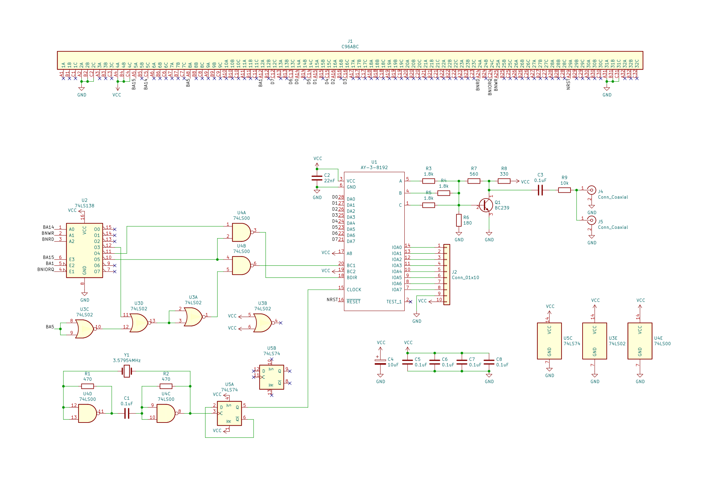
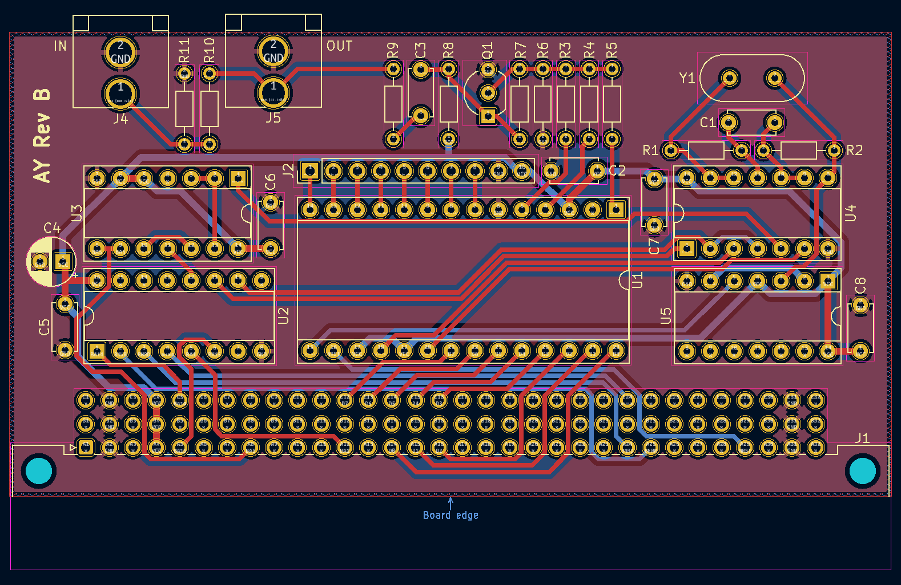
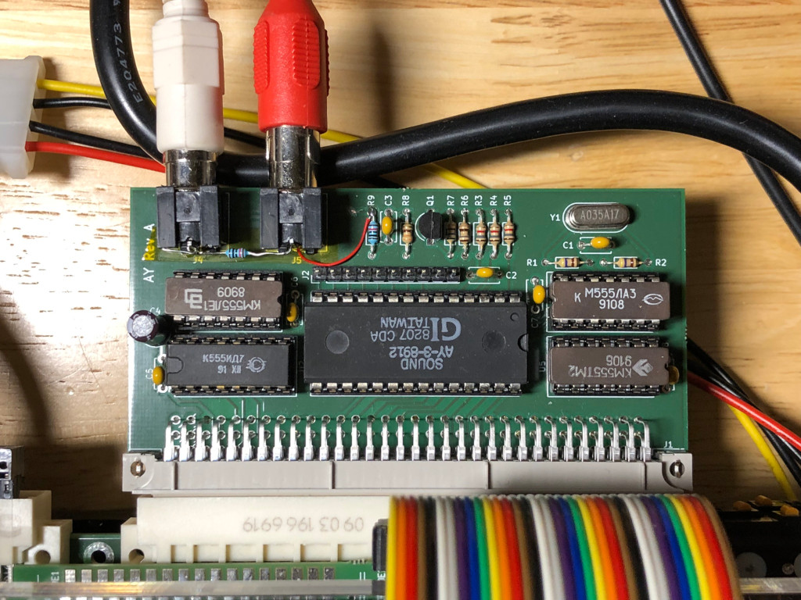

# Interfața de AY-3-8192 pentru Cobra

Aceasta este o interfață simplă de AY-3-8192 pentru conectorul extensie al
microcalculatorului românesc Cobra.

Logicul de interfață se bazează pe logcul din [Simple AY interface de
hw.speccy.cz](Simple AY interface), și amestecarea ieșirii se bazează
Spectrum-ul 128K.

Interfața are o intrare pentru beeper-ul Cobra-ului și se amestecă cu ieșirea
AY-3-8192.

[Simple AY interface]: https://hw.speccy.cz/ayinterface.html

## Probleme

Această revizuire a interfeței are câteva probleme, și nu ar trebui să
fabricați așa cum este.

* Pinii conectorilor RCA sunt inversat.  A repara asta nu este distractiv.
* Conectorii RCA nu sunt suficient de aproape marginea plăcii.
* Doi rezistori lipsesc să potrivesc nivelurile beeper-ului cu ieșirea
  AY-3-8192 - 1K între intrarea și masă, 10K între intrarea beeper-ului și
  ieșirea plăcii.

## Imagine

