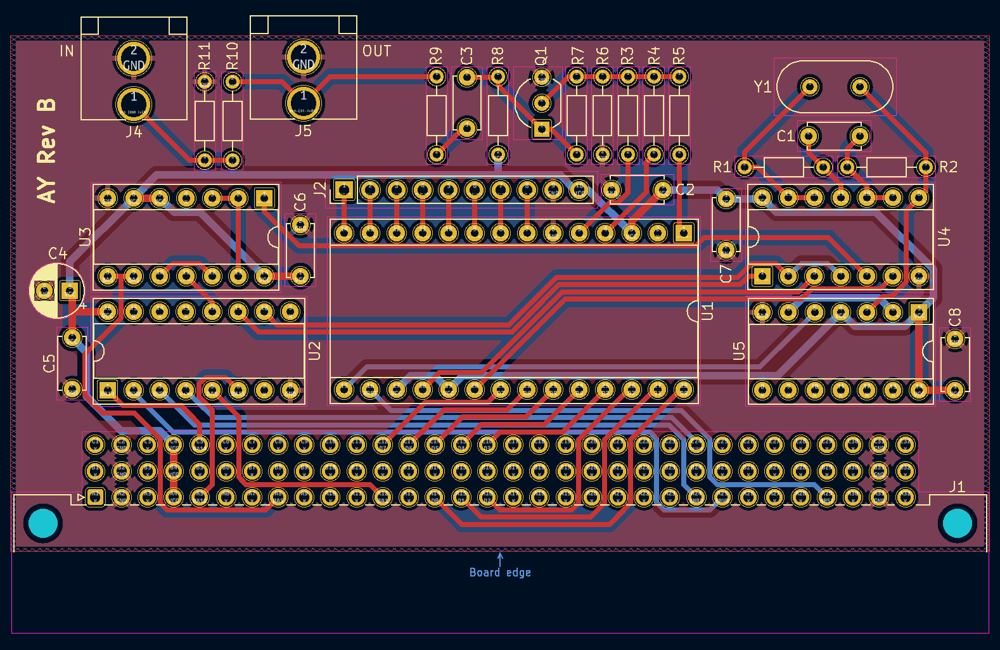

(Vezi [README-ro.md](README-ro.md) pentru o traducere greșită în română.)

# AY-3-8192 interface for Cobra

This is a simple AY-3-8192 interface for the expansion port of the Romanian
microcomputer Cobra.

The interface logic is based on the logic in the [Simple AY interface by
hw.speccy.cz](Simple AY interface), and the output mixing is
based on the Spectrum 128K.

The board has an input for the Cobra's beeper output and mixes it with the
AY-3-8192 output.

[Simple AY interface]: https://hw.speccy.cz/ayinterface.html

## Bodges

This revision of the board a few problems, and should not be fabricated as-is:

* The pins on the RCA connectors are swapped.  Not fun to fix.
* The RCA connectors are not placed close enough to the edge of the board.
* A couple of resistors are missing on the audio input side to match the beeper
  levels to the AY-3-8192 output - 1K between beeper input and ground, 10K
  between beeper input and board output.

## Images

